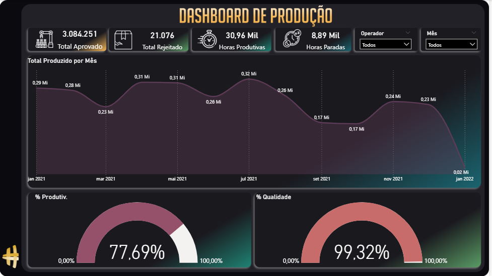

# ⚙️ Dashboard de Produção — Power BI

## 🎯 Objetivo
Criar um painel no **Power BI** para acompanhar a **eficiência da produção industrial**, incluindo:  
- Total produzido por mês  
- Horas produtivas x horas paradas  
- Índice de produtividade  
- Índice de qualidade  

Esse dashboard apoia a **gestão de processos e melhoria contínua**.

---

## 🗂️ Dataset
- **Fonte:** dados simulados para estudo.  
- **Período:** Jan/2021 a Jan/2022.  
- **Campos principais:** Mês, Produção Aprovada, Produção Rejeitada, Horas Produtivas, Horas Paradas, Operador.

---

## ⚙️ Modelagem de Dados
- **Tabela de Fatos:** Produção  
- **Dimensões:** Tempo, Operador, Qualidade  
- **Relacionamentos:**  
  - Tempo → Produção (1:N)  
  - Operador → Produção (1:N)  

---

## 📐 Métricas em DAX
Exemplos de medidas utilizadas:

**% Produtividade**
```DAX
Produtividade % = DIVIDE([Horas Produtivas], [Horas Totais])
```

**% Qualidade**
```DAX
Qualidade % = DIVIDE([Qtd Produção Aprovada], [Qtd Produção Total])
```

## 📸 Screenshots
**Visão Geral**


## 🔎 Insights Obtidos

- Produção total no período: **3,08 milhões de unidades aprovadas**

- Taxa de rejeição: **21 mil unidades (~0,68%)**

- Produtividade média: **77,69%**

- Qualidade média:**99,32%**

- Meses críticos: **Set/2021 e Out/2021 com queda na produção**

## 🚀 Tecnologias Utilizadas

- Power BI Desktop

- DAX

- Modelagem Dimensional

## 👩‍💻 Autora
[Fiama Ribeiro](https://github.com/fiamaribeiro)  
Estudante de Gestão de T.I. (Anhanguera) e profissional em transição para a área de Dados & BI.
